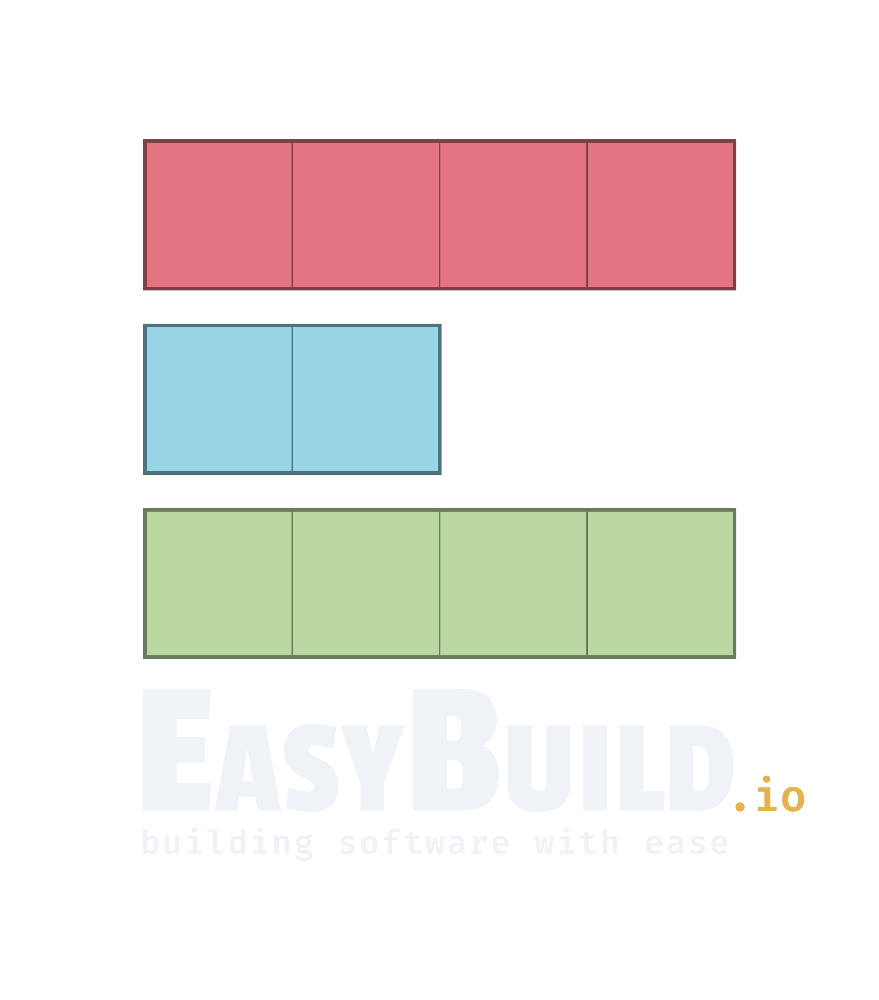
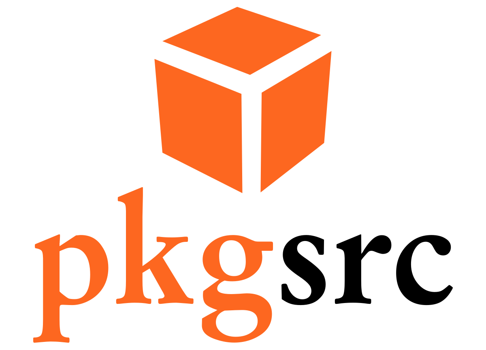
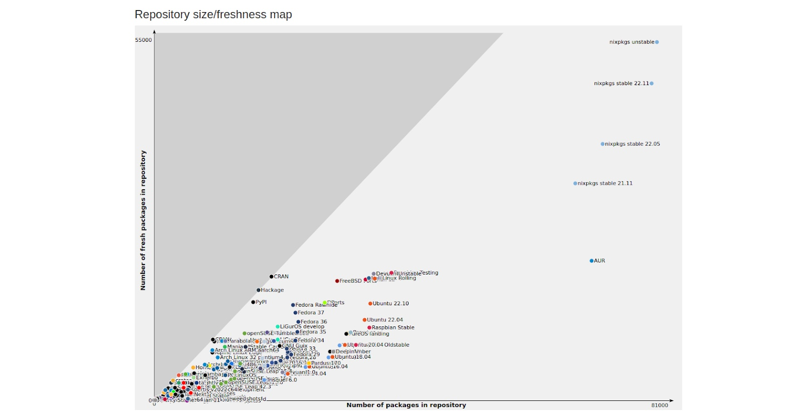
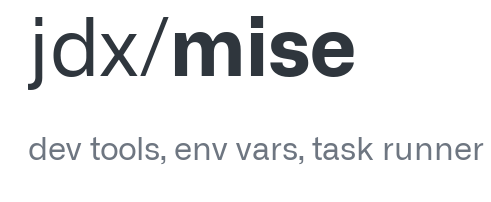

Who am I?
===

<!-- column_layout: [1, 2] -->
<!-- column: 0 -->

<!-- alignment: left -->


<!-- column: 1 -->
* 󱩊 Research Software Engineer at UCL ARC
* 󱖴 Rides bikes on weekends
* 󰣇 Uses Arch btw
* 󰵭 Test cricket fan
<!-- pause -->
*  Command-line enthusiast

```bash +exec +acquire_terminal
# So, from the recent Anderson-Tendulkar Trophy
/// crictty --match-id 105780 | head -n 15
```

<!-- end_slide -->

The Unix Philosophy
===

>This is the Unix philosophy:
Write programs that do one thing and do it well.
Write programs to work together.
Write programs to handle **_text_** streams, because that is a universal interface.

<!-- alignment: right -->
Doug McIlroy, Bell Labs Computing Sciences Research Center
<!-- alignment: left -->
 https://en.wikipedia.org/wiki/Unix_philosophy#Do_One_Thing_and_Do_It_Well

<!-- end_slide -->

Command-line interfaces and HPC systems
===

* The default user interface on HPC systems
<!-- new_lines: 1 -->
* Users are provided with Secure Shell (SSH) access
<!-- new_lines: 1 -->
* Edit/Compile/Debug cycle on remote systems
<!-- new_lines: 1 -->
* Job submission workflow and non-interactive compute node use that uses
  schedulers
<!-- pause -->
> [!NOTE]  
>  Often not emphasised: interactive use e.g. text editing, searching, command history ...

<!-- end_slide -->

Towards a homogeneous environment
===

> [!TIP]  
>  Need an environment identical to personal workstation on all remote hosts (HPCs, VMs, Containers ...)

# Workstation platforms (OS/CPU Architectures)

<!-- alignment: center -->
| Operating System | x86 (32-bit) | x86_64 (64-bit) | ARMv7 (32-bit) | ARM64 (AArch64) | RISC-V | PowerPC |
|------------------|--------------|------------------|----------------|------------------|--------|---------|
| Windows          |              |                  |                |                  |        |         |
| Linux            |              |                  |                |                  |        |         |
| *BSD             |              |                  |                |                  |        |         |
| macOS            |              |                  |                |                  |        |         |
| AIX              |              |                  |                |                  |        |         |
| Haiku            |              |                  |                |                  |        |         |
| ReactOS          |              |                  |                |                  |        |         |
| RedoxOS          |              |                  |                |                  |        |         |


<!-- end_slide -->
# Realistic support matrix for combined Desktop/HPC

<!-- alignment: center -->
| Operating System | x86_64 (64-bit) | ARM64 (AArch64) |
|------------------|------------------|------------------|
| Linux            | ✅               | ✅               |
| macOS            | ❓               | ✅               |
| Windows          | ❓               | ❓               |

<!-- alignment: left -->
# Common environment?
 * Shell startup files (aliases, environment variables, cleanup ...)
<!-- new_lines: 1 -->
 * Cross-platform CLI/TUI tools
<!-- new_lines: 1 -->
 * Configuration files for tooling

<!-- end_slide -->
<!-- jump_to_middle -->
Hands-on example
===

<!-- end_slide -->

Scenario
===

# All hosts in the inventory

```file +render
path: ./inventory_all.txt
language: mermaid
```

<!-- end_slide -->

Consider only remote (HPC) hosts in the inventory
===

```bash +exec
hostname
```

<!-- end_slide -->


# Remote hosts in the inventory
```file +render
path: ./inventory_remote_only.txt
language: mermaid
```

<!-- end_slide -->

Config file synchronisation across hosts
===
<!-- new_lines: 1 -->
*  Clone/sync on remote host with a Version Control System (VCS)
<!-- new_lines: 1 -->
* [A dotfiles manager](https://dotfiles.github.io/)
  * GNU Stow
  * dotbot
  * rcm
  * and many many more!
<!-- end_slide -->

Chezmoi
===
* I have settled on using Chezmoi (pronounced `shay-mwa`) 
<!-- new_lines: 1 -->
* Full power of go templates

```bash +exec +acquire_terminal
# chezmoi data
/// chezmoi data | bat -l json
```

<!-- end_slide -->
Chezmoi templating
===

```gitconfig
$HOME/.config/git/config
[user]
    {{- if eq chezmoi.hostname "blend" }}
    email = "personal_email@personal_host.co.uk"
    {{- else }}
    email = "work_email@work.ac.uk"
    {{- end }}
```

```bash
user@blend $ chezmoi apply
```

```gitconfig
[user]
    email = "personal_email@personal_host.co.uk"
```

<!-- end_slide -->


Deploy on all systems
===
# Use a configuration management tool
<!-- new_lines: 1 -->
*  Ansible (agentless, push model) 
<!-- new_lines: 1 -->
*  Puppet 
<!-- new_lines: 1 -->
* 󰭼 Chef
<!-- new_lines: 1 -->
* Salt stack
<!-- new_lines: 1 -->
* Pyinfra
<!-- new_lines: 1 -->
* ...

<!-- end_slide -->

<!-- jump_to_middle -->

Tooling/Packages
====
<!-- end_slide -->


Combinatorial explosion of packages
===

>Consider
    m: different processor architectures (target CPUs),
    n: different operating systems,
    p: different executable tools.

Total number of binaries to be managed:
```latex +render
\[ \le m \times n \times p \]
```
Even with 3 CPU architectures and 20 tools to be managed, we have about 60
executables to manage, from which the valid binaries for each platform must be
identified and deployed on the p-th machine.

<!-- end_slide -->

Managing package lifecycle
===
## Install (?), Update to latest, Pin versions of selected packages/tools, Remove packages

<!-- pause -->
<!-- column_layout: [1, 1, 1, 1] -->
<!-- column: 0 -->

```file 
path: ./global_packages_1.txt
language: text
```

<!-- column: 1 -->
```file 
path: ./global_packages_2.txt
language: text
```


<!-- column: 2 -->

```file 
path: ./global_packages_3.txt
language: text
```

<!-- column: 3 -->

```file 
path: ./global_packages_4.txt
language: text
```

<!-- end_slide -->


Linters, Formatters, Language Runtimes, Compilation frameworks, Utilities ...
===
<!-- column_layout: [1, 1, 1, 1] -->

<!-- column: 0 -->


```file 
path: ./global_packages_5.txt
language: text
```

<!-- column: 1 -->

```file 
path: ./global_packages_6.txt
language: text
```


<!-- column: 2 -->
```file 
path: ./global_packages_7.txt
language: text
```

<!-- column: 3 -->
```file 
path: ./global_packages_8.txt
language: text
```


```bash +exec
# Let's count the total
wc -l ./global_packages.txt
```

<!-- end_slide -->

<!-- jump_to_middle -->
How to manage these software tools/packages everywhere?
===

<!-- end_slide -->
# System package manager?
* apt-get/apt
* yum/dnf
* zypper
* pacman

## Let's try

```bash +exec
which vim
```

<!-- end_slide -->

Let us install vim
===

```bash +exec
# which OS are we on?
/// cat /etc/*release
```

<!-- end_slide -->
```bash +exec
pacman -S vim
```

<!-- end_slide -->
## Cannot do this on remote HPC systems. But let us on our local machine

```bash
su krishnakumar 
sudo pacman -S vim
```

<!-- end_slide -->
Software Package Management on a HPC system
===
* Curated list of scientific software pre-installed (and upon request)
<!-- new_lines: 1 -->
* Versions are user-switchable by a modules system (environment-modules/Lmod)
<!-- new_lines: 1 -->
* Custom user-modules can be loaded
<!-- new_lines: 1 -->
* Unpriveleged container execution with container runtimes like Apptainer/Singularity/Podman?

<!-- pause -->

> [!CAUTION]  
>  But we are talking about installing simple productivity tools and keeping them up-to-date
> Not scientific libraries and programs

<!-- end_slide -->
Popular HPC packaging ecosystem
===

<!-- column_layout: [1, 1] -->
<!-- column: 0 -->
<!-- jump_to_middle -->

<!-- column: 1 -->

<!-- reset_layout -->

<!-- end_slide -->
<!-- jump_to_middle -->
* Intended for scientific software and libraries (GROMACS, LAMMPS, MPI ...)
<!-- new_lines: 1 -->
* Support complex build provenances (MPI libraries, dependency versions, compilation toolchain ...)
<!-- new_lines: 1 -->
* Latest versions of utility tools often not available
<!-- end_slide -->

So, what are the options available?
===

<!-- column_layout: [1, 1, 1] -->
<!-- column: 0 -->

<!-- column: 1 -->

<!-- column: 2 -->

<!-- reset_layout -->


<!-- column_layout: [1, 1] -->
<!-- column: 0 -->

<!-- column: 1 -->


<!-- end_slide -->

Nix was it for me!
===

<!-- end_slide -->

However!
===

<!-- end_slide -->

So, is there a solution?
===

# Desired characteristics
* Declarative/Idempotent
<!-- new_lines: 1 -->
* Reproducible
<!-- new_lines: 1 -->
* Installable/Runnable from user home directory 
<!-- new_lines: 1 -->
* Cross-platform
<!-- end_slide -->

<!-- column_layout: [1, 1] -->
<!-- column: 0 -->

<!-- new_lines: 1 -->
# pixi global
* install
<!-- new_lines: 1 -->
* edit
<!-- new_lines: 1 -->
* sync
<!-- new_lines: 1 -->
* manifest file `pixi-global.toml`
<!-- column: 1 -->
<!-- pause -->

<!-- new_lines: 1 -->
# Mise
<!-- new_lines: 1 -->
* `use -g`
<!-- new_lines: 1 -->
* `prune`
<!-- new_lines: 1 -->
* global `config.toml`

<!-- end_slide -->

Keeping tools up to date
===


<!-- end_slide -->

Further resources
===

## Worflow configuration codes, presentation in HTML & PDF formats

